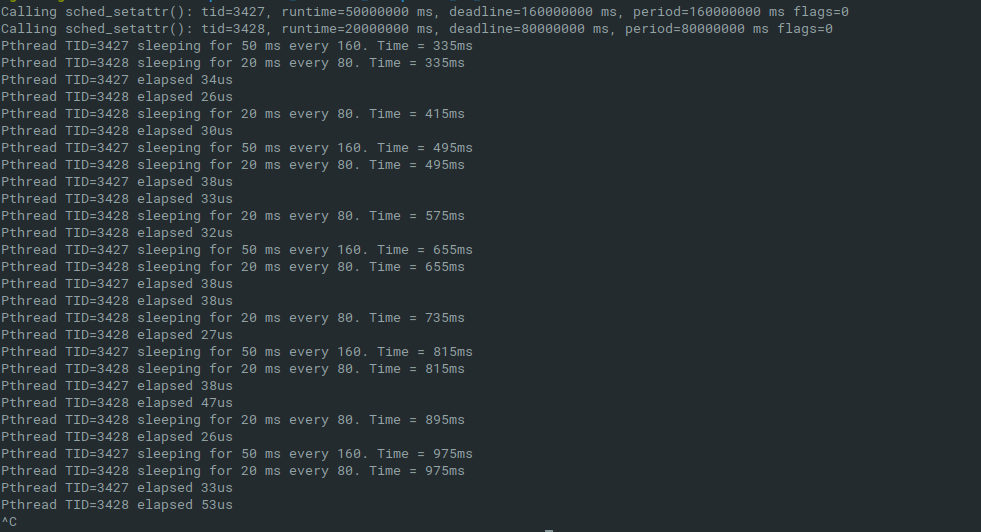

This simple demo shows how to create a very simple sched-deadline = G-EDF + CBS.

It creates a task that executes for C = 50ms every D = T = 160ms and another one that executes for C = 20ms every D = T = 80ms. CPU utilization is 5/16 + 1/4 = 3/8 <= 100%, thus the set can be scheduled by EDF. 

HOW TO USE
--------------------------------------
Linux Kernel 3.14+

make
sudo ./main

RESULTS
--------------------------------------
Since periods are harmonic (80ms and 160ms), output tasks of C = 20ms, C = 20ms, C = 50ms and so on, as you can see in "my_result.png".

LESSON LEARNED
--------------------------------------
Roughly simulate WCET busy time:
	#include <time.h>
	#include "timespec.h" // timespec_add_us()

	struct timespec ts_start, ts_next;
	clock_gettime(CLOCK_MONOTONIC, &ts_start);
	ts_next = ts_start;
	timespec_add_us(ts_next, wcet_us[index]);
	clock_nanosleep(CLOCK_MONOTONIC, TIMER_ABSTIME, &ts_next, NULL);

Deschedule task:
	sched_yield();

USEFUL LINKS
---------------------------------------
- https://github.com/evidence/test-sched-dl - SCHED_DEADLINE examples
- http://www.cs.colby.edu/maxwell/courses/tutorials/maketutor/ - basic guide on Makefiles
- http://disi.unitn.it/~abeni/RTOS/sched_deadline.pdf - some theory by Prof.Abeni
- http://events17.linuxfoundation.org/sites/events/files/slides/SCHED_DEADLINE-20160404.pdf - further theory
- https://ti.tuwien.ac.at/ecs/teaching/courses/brds/slides-1/rt-linux - theory from TU Wien
- https://github.com/torvalds/linux/blob/master/Documentation/scheduler/sched-deadline.txt - official doc on SCHED_DEADLINE

CREDITS
--------------------------------------
Agostino Mascitti - original author, Nov. 2018
